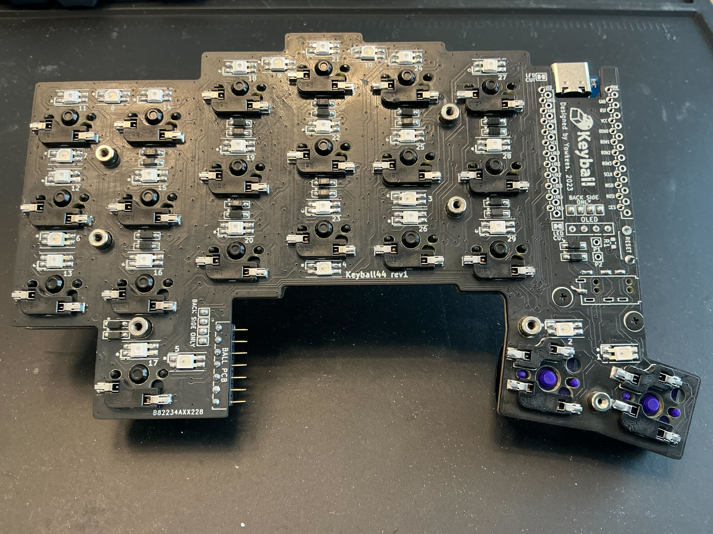
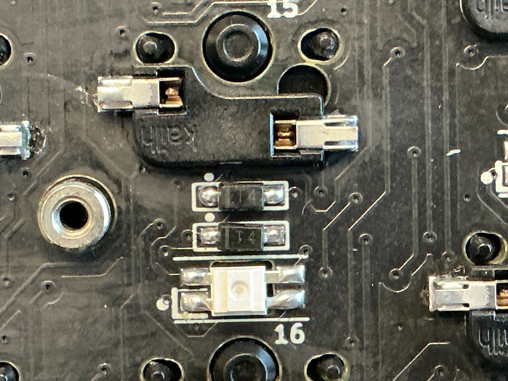
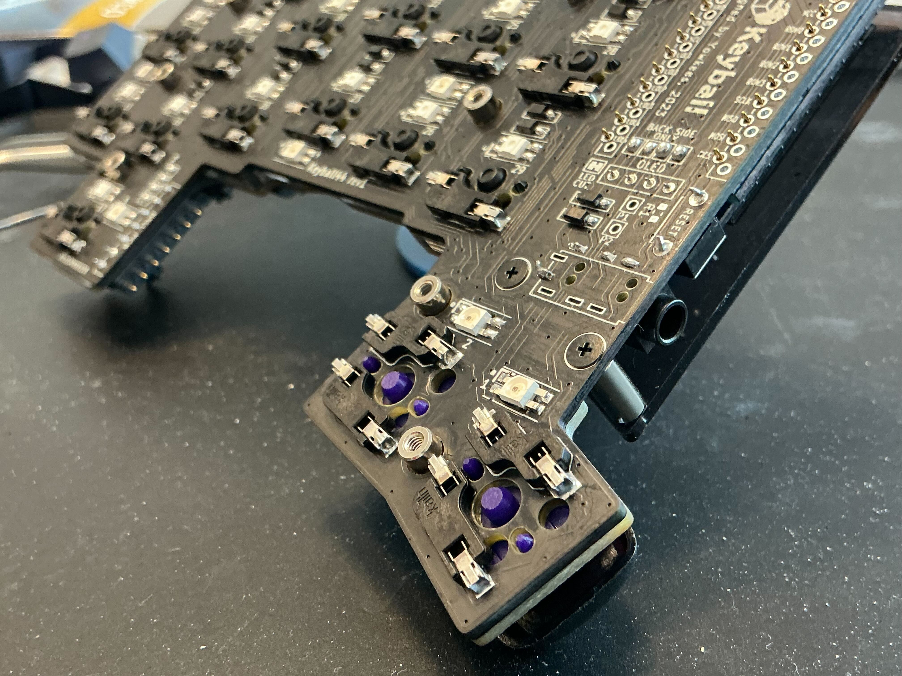
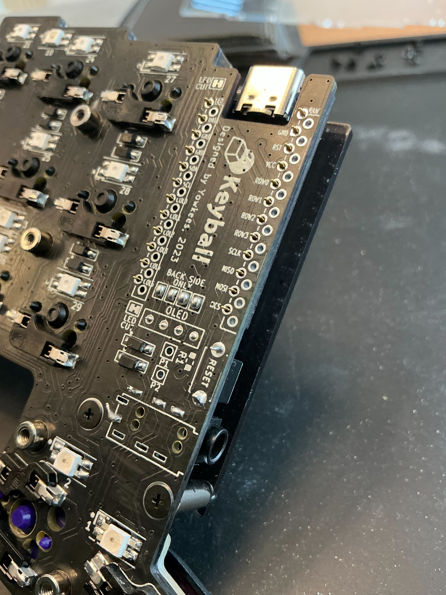
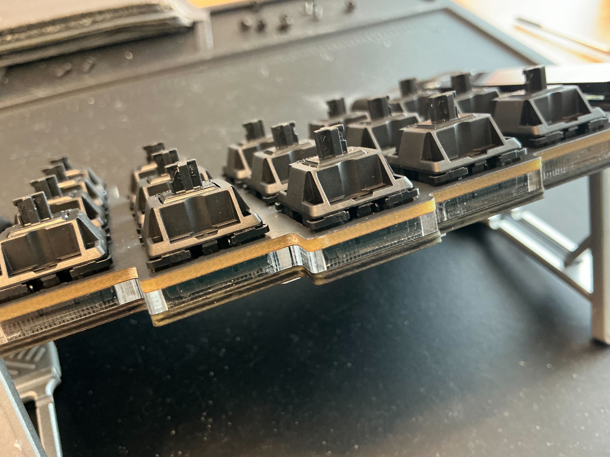
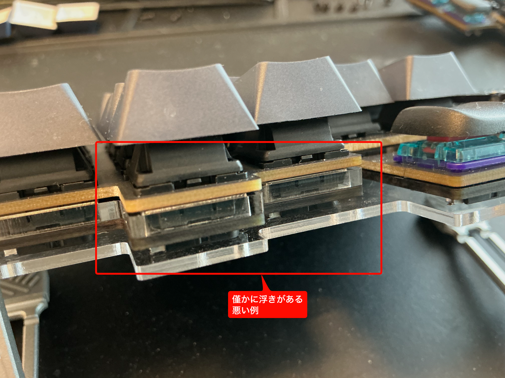

# Keyball 組み立てガイド

---

## 概要

このドキュメントは Keyball の組み立て手順をまとめたものです。
PCBへの半田付けからプレート・キースイッチの取り付け、最終動作確認までの作業工程を説明します。

---

## 目次

- [用意するもの](#用意するもの)
- [大きな流れ](#大きな流れ)
- [半田付けの注意点（共通）](#半田付けの注意点共通)
- [組み立て手順](#組み立て手順)

---

# 用意するもの

## 必須

| 道具 | 用途 |
|-----|-----|
| 半田ごて | 電子部品の半田付け |
| 半田（低融点） | 電子部品固定 |
| 精密ドライバー | ケース組み立て |

---

## ほぼ必須

| 道具 | 用途 |
|-----|-----|
| ピンセット | SMD部品配置 |
| フラックス液 | 半田の馴染み改善 |
| 無水エタノール | フラックス除去 |
| 半田吸い取り線 | 半田修正 |

---

## あった方が安心

| 道具 | 用途 |
|-----|-----|
| 作業用マット | 部品紛失防止 |
| 歯ブラシ | フラックス清掃 |

---

# 大きな流れ

| 手順 | 作業 |
|-----|-----|
| 1 | ダイオード半田付け |
| 2 | LED半田付け |
| 3 | キーソケット半田付け |
| 4 | ProMicro半田付け |
| 5 | テスト用ファームウェアでテスト |
| 6 | トラックボール用ソケット半田付け |
| 7 | ミドル・トッププレート設置 |
| 8 | キースイッチ設置 |
| 9 | キーキャップ設置 |
| 10 | ボトムプレート設置 |
| 11 | トラックボール設置 |
| 12 | 最終テスト |

---

# 半田付けの注意点（共通）

| 項目 | 内容 |
|-----|-----|
| フラックス | 少量のみ使用 |
| 半田 | 少量（ショート予防） |
| 加熱時間 | 1〜2秒 |
| 固定方法 | 4端子の1箇所のみ先に半田付け |

部品を固定する際は
**半田の高さ分だけ部品が沈み込むことを確認する。**

---

## フラックス清掃

### 作業

1. 綿棒または歯ブラシに無水エタノールをつける
2. 半田付け部分を軽くこする
3. フラックスを拭き取る

理由

フラックスを残すと

- 他回路との通電
- 電力効率低下

の原因になる。

---

# 組み立て手順

---

## ダイオード

### 作業

1. PCBのダイオード位置を確認する
2. ダイオードの向きを確認する
3. ピンセットで配置する
4. 片側端子を半田付けする
5. 反対側を半田付けする

### 注意

| 項目 | 内容 |
|-----|-----|
| 半田温度 | 約350℃ |
| 半田状態 | 端子と銅線を密着させる |

---

## LED

### 作業

1. PCBのLED番号と配置を確認する
2. LEDの向きを確認する
3. LEDを配置する
4. 片側端子を半田付けする
5. 残り端子を半田付けする

### 注意

| 項目 | 内容 |
|-----|-----|
| 半田温度 | 約300℃ |
| 作業方針 | 一度で半田付けを終える |

理由

LEDは熱に弱く、繰り返し加熱すると破損しやすい。

### トラブルシュート

LEDが途中から点灯しない場合
**先頭側LEDの通電を確認する**

理由
LEDは直列チェーン構造のため
前段LEDが動作しないと以降すべて点灯しない。

---

## キーソケット

### 作業

1. ソケット位置を確認する
2. PCBに配置する
3. 片側端子を半田付けする
4. PCBに密着していることを確認する
5. 残り端子を半田付けする

### 注意

| 項目 | 内容 |
|-----|-----|
| 半田量 | やや多め |
| 密着 | PCBと密着 |

理由

半田量が少ないと

- キースイッチ装着時に外れる
- キーキャップ装着時の応力で半田割れ

が発生する。

---

## ProMicro

### 作業

1. 向きを確認する
2. ピンヘッダに差し込む
3. 水平を確認する
4. 半田付けする

### 注意

| 項目 | 内容 |
|-----|-----|
| 向き | 必ず確認 |
| 圧力 | 加圧しすぎない |

---

## テスト

### 作業

1. テスト用ファームウェアを書き込む
2. キー入力確認
3. LED確認

---

## トラックボール用ソケット

### 作業

1. ソケットを配置する
2. 半田付けする
3. 水平を確認する

---

## プレート設置

### 作業

1. ミドルプレートを置く
2. トッププレートを重ねる

### 注意

PCBとプレートが密着していることを確認する。

---

## キースイッチ設置

### 作業

1. 四隅から順番にキースイッチを設置する
2. プレート全体の密着を確認する
3. キースイッチ中心を垂直に押し込む
4. 内側へ順番に設置する

### 注意

| 項目 | 内容 |
|-----|-----|
| 設置順 | 四隅 → 内側 |
| 押し込み | 垂直 |

理由

キースイッチはプレート固定の役割も持つ。
浮きがあると

- キー接触不良
- キーキャップ脱着トラブル

が発生する。

浮きがある場合
**キースイッチを全て外してやり直す。**

---

## キーキャップ設置

### 作業

1. キーキャップを合わせる
2. 垂直に押し込む

---

## ボトムプレート設置

### 作業

1. ボトムプレートを配置する
2. ネジで固定する

---

## トラックボール設置

### 作業

1. トラックボールを入れる
2. 回転を確認する

---

## 最終テスト

### 作業

1. キー入力確認
2. LED確認
3. トラックボール動作確認
